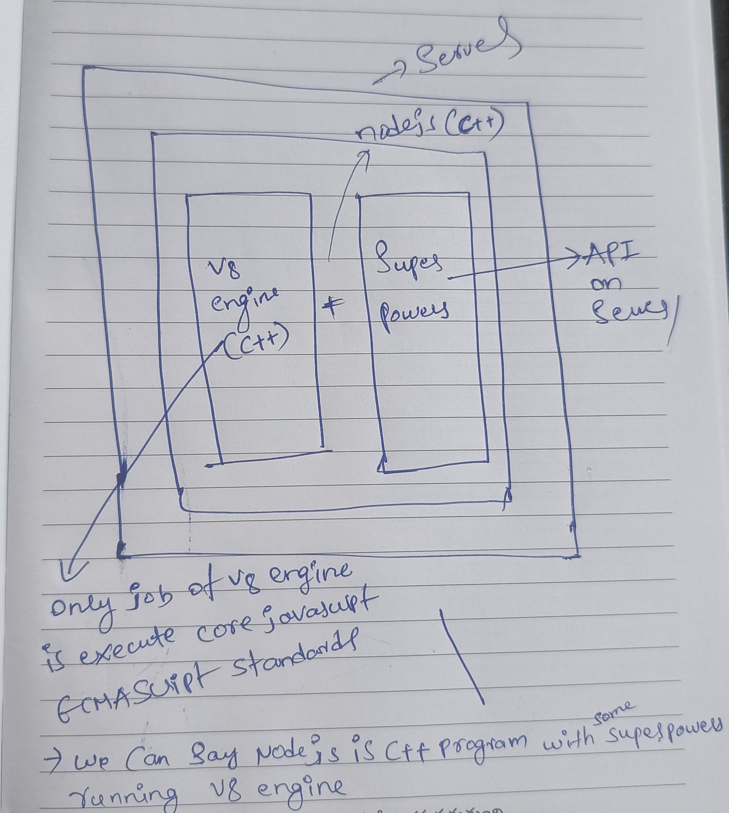
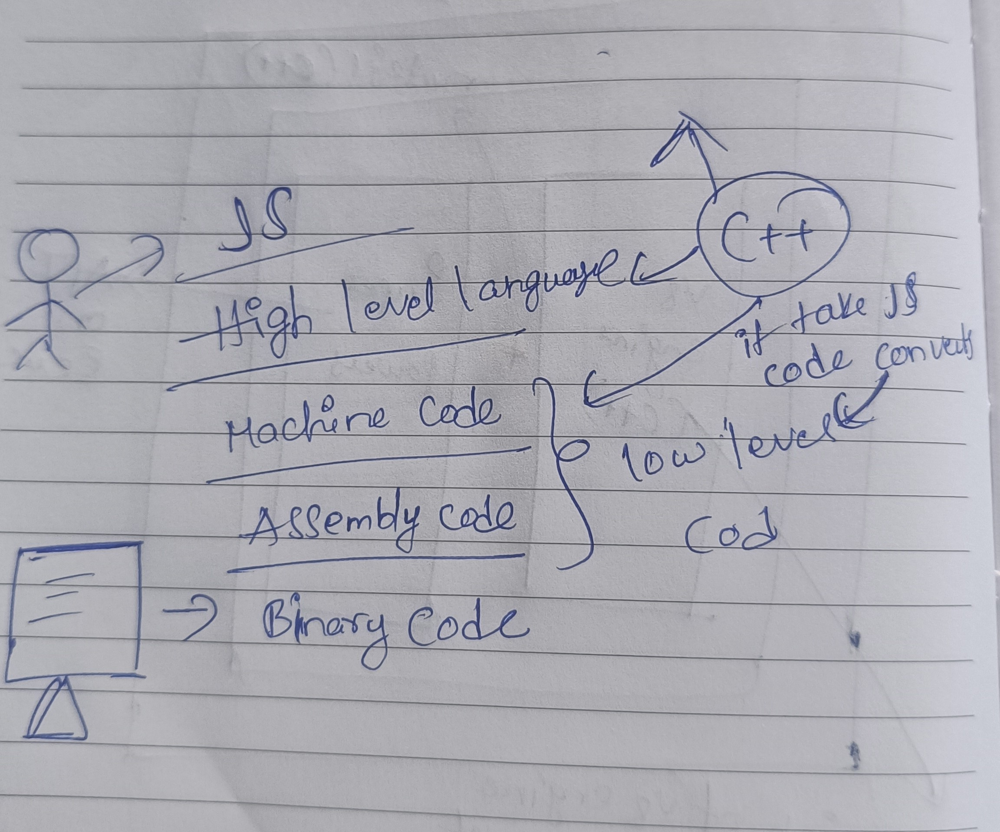
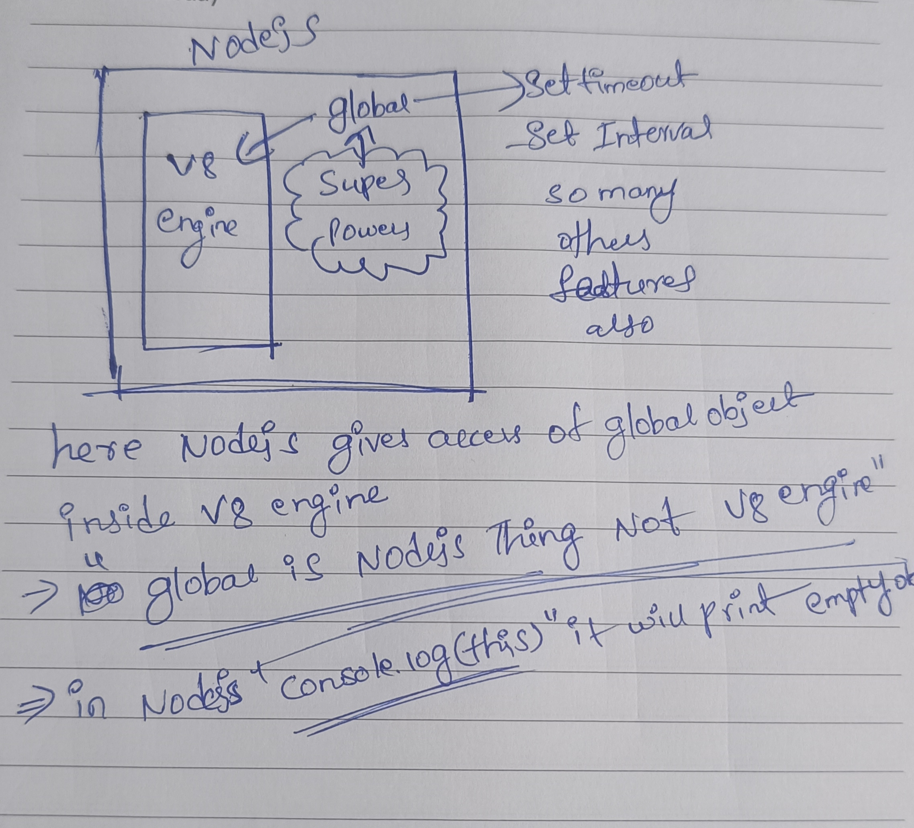

# nodejs

- **what is nodejs?**
- **nodejs is a javascript runtime environment built on chrome javascript v8 engine**
- and executes javascript code outside of the web browser what is that means eariler javascript used and managed over the web and it used to be dominated in webworld.but when nodejs came in.javascript can run everywhere.so bascially it helps to execute the code outside the browser. not just limited to servers you can run javascript in lot of places you can't even think of.so you can do lot of things with nodejs
- **(In Wikipedia its Says)** **Nodejs is a cross platform** (it can run on windows,macos,linux)
- **nodejs is opensource and its maintained by openjs foundation**
- basically who adds the new features and updates so its added by the commity of the openjs foundation
- nodejs helps you to run the javascript out side the browser (it means javascript now not limited to browser only)
- nodejs has an **event-driven-architecture** capable of **asynchronous i/o** also some times known as **non blocking i/o** (it means Node.js does not wait for slow operations (like file reads, DB queries, network calls) to finish before moving on to the next task.)
- **whereever there is javascript there will always be a javascript engine**
- every browser runs the javascript and every browser has javascript engine and every browser has its own javascript engine
- **nodejs first version relased on 2009 and developed by Ryan Dahl**

### history of nodejs

- in 2009 nodejs was born and Ryan dahl created the nodejs
- every code you write in nodejs is javascript to run the javascript you need JS engine
- **whereever javascript there is javascript engine which executes it.without javascript engine you can't just run the javascript**
- **when Ryan dahl developed nodejs.he didn't use v8 engine**. he started with spider monkey (its javascript engine which is found in firefox)
- basically every browser has its own javascript engine.here chrome has v8 engine similarly firefox has engine which is spider monekey
- **within 2 days he said iam done with spider monkey and he started using v8 engine** then he never looked back
- later on there were few versions of nodejs which is used spider monekey behind the scenes
- but today the offical nodejs is using v8 engine behind the scenes.and v8 engine became popular and v8 engine powers
- when ryan developed nodejs he developed independently but there is a company "Joyent".this company also working on something similar to what nodejs was.so here the company was buidling internal project where there were trying to use javascript on the server. there were really passinated by the idea of ryan dahl
- the comapny said to Ryan dahl.come and work on nodejs in our company and became our employee.and build the project under us.and will fund it.and encourge it.support it
- if nodejs exist there is a very big contribution of Joyent in it
- slowly slowly nodejs started becoming big.and Joyent company internally started using nodejs
- now nodejs not maintained by Joyent company
- **eariler name of nodejs was web.js.because Ryan said i want to create web server using this technology.so named as web.js.**
- but later on when he relized the potential he renamed to nodejs and said that nodejs is bigger thing,its not just limited to build the webservers.you can build anything out of it that is why he said nodejs.
- **when he was trying to create the nodejs why did he created the nodejs.what was the problem.there was something called Apache which is used to create HTTP server and this is kind of "blocking server".Ryan wanted to create "Non Blocking I/O".that was the reason why Ryan was developed the Nodejs.**
- **the advantage of "Non Blocking I/O" it can handle multiple requests with lesser number of threads**
- **in 2010 npm happened.** npm is package manager for node.developer from Joyent decided to create the package manager for it.so that everybody can contribute and build small small package.
- basically npm is a registry.a central place where you can add new packages.
- suppose you want to handle time and date for that you have the package like that you have lot of packages.everything present in npm
- **when npm was developed this is very significant achivement for nodejs.nodejs as framework would not be successfull if npm was not there.**
- why nodejs is popular because of the npm
- **in 2011 windows support added initally it was build for macos and linux.**
- now in 2011 windows support came up that was lead by **Joyent + Microsoft**.because its was gained by lot of popularity.
- **in 2012** after 3 years Ryan dahl left the project.i have no issues with project and company but iam not maintaining the project.then responsibility given to the "Isaac" who was created the npm.he was project lead of the nodejs.thats how Issac took over it.
- ryan got off from the project that pace of developement of the nodejs started becoming slow.chorme was realising new new version of nodejs but the developement speed of the nodejs become slow.
- **in 2014** the developer name Fedar.he created the fork of the nodejs.and he named as io.js.
- now nodejs is 2 things there is io.js and node.js and everything messed up
- in sep 2015 there was nodejs foundation commite formed and everything merged and called it as nodejs
- in 2019 there was commite "Js foundation" and "nodejs foundation" and these 2 commites merged and create new commit which is "openJs foundation"
- since 2019 this openJs foundation took the controll over the nodejs.this commite responsible for nodejs

## Js on server (episode 2)

- Nodejs comes with the philosaphy it can run outside the browser primarly on server.
- **server means nothing its a remote computer or cpu or computer working remotely**
- you are running your website on the server what is that means you are running your website somebody else computer or colud located remotly
- at the end of the day its one machine one cpu which is receving that request.that receving computer known as server.
- suppose you wrote google.com in your computer.here every domain name maps to the IP.suppose here ip assume 111.4.5.67.so this ip map to the device or computer or server (server means machine)
- initally you can use Javascript only on browsers but after nodejs came in we can use javascript on server as well.
- why this was powerfull when javascript was used only for frontend or client there are diffrent frontend developers on the backend there were language like java,c++ etc used there are separate backend developer.
- now javascript come in server as well. so what happened is there is an opprotunity for single developer to develop the full stack
- "Nodejs is c++ code"
- JS engine - v8(developed by google) here V8 is C++ program
- JS engine uses C++ to execute the javascript code
- at end of the Javascript engine is the C++ program.so javascript engine is the not the machine
- you can search for v8 engine opensource there you can see 72% C++ used.and other things javascript and typescript python also used.
- if you are using javascript engine means you are executing C++ program

#### what is v8 engine?

- **V8 is Google's open source high performance javascript and WebAssembly engine, written in c++.**
- it is used in Chrome and in Node.js and it implements ECMAScript and WebAssembly and runs on Windows macOS,and Linux systems
- **V8 can be embedded into any C++ application. that is reason Nodejs also created using c++ with v8 engine embedded into it**
- embedded means you can imagine like inside outside layer nodejs and inside that nodejs we can have another layer that is v8 engine.
- it means what is v8 engine v8 engine job is to execute the javascript program
- basically what happens is you write some javascript code and that javascript code read by V8(C++ program) then converted to code which machine understands it.
- here V8 convert javascript code to machine level code and machine understands it and execute that code.that how v8 writes
- here javascript and C++ all these wroking in tandom. javascript is being read by C++.and then telling machine its converted and at the end its binary which computer understand
- so we can't say like C++ is better than javascript or javascript is better than C++.here every technology has its own specific usecase and it has own specific potential.and own specific problem it resolves.
- **when V8 can be embedded into any C++ application.this is the main thing.which is lead to the nodejs invention**
- when V8 Can be lead to the nodejs invention.what creator of nodejs is did.he created node.js.again.
- so here nodejs is the C++ application with v8 embedded into it.

### when v8 can execute our javascript code why was the need of nodejs?

 

- **now V8 is javascript engine.it follows ECMAScript Standards.**(it means ECMAScript is a standard for scipting languages.including javascript,JScript so whatever code you write in javascript you follow the standard like var a =10;)
- and this ECMAScript standards not just followed by Javascript.but lot of other language.but javascript is most popular language among all other languages.

### ECMA Script Standards//Rules.

- example you have written "===" for comparsion these rules are defined by the Ecmascript standards
- alot of JS engines follow these Standards.because here these standards are defined by the central commity.
- here suppose we have diffrent Javascript engines for diffrent browsers and implemented diffrent logic for creating this javascript engine.but these javascript engines follows the specific standards which is ECMAScript Standards
- **so here V8 Can't go outside the ECMAScript Standards.**
- but nodejs has v8 engine and it has lot more super powers.and that nodejs when it runs on the server makes it very powerful.here
- you can say super powers are API's on the server
- example: if you want to access your database onto the server.suppose there is sql database installed or mongo database installed.if you want connect to that database through javascript how will that happens.so here V8 can't connect to the database right.because it does not access to connect to the database. suppose you want to make network request(http) to someother computer.V8 Cann't do that. because it is not ECMAScript standards.here only job of V8 engine is to Execute the Core javascript (ECMAScript Standards).V8 can't fetch the image from folder.so you need some super powers that super powers comes in form of the API.that is the core thing nodejs adds into the V8 engine.and this Nodejs is known as "JS runtime Environment"
- here Nodejs has some more super powers on top of the v8 engine
- V8 + some super powers is the Nodejs and this is know as Javascript Runtime and this nodejs executed on the server
- Nodejs is build using javascript and C++ and at the end of the its C++ program.but it also has lot Javascript Api's(these apis which user can call and connect to the database)
- its like one layer on top it another layer and on top of it another layer etc.. opensource build something like this. here Somebody maintaing nodejs. and somebody build modules on this nodejs.somebody maintaining ECMAScript Standards and on top it V8 and on top V8 there is nodejs and on top nodejs there is other applications which are buiild.
- **you can go to nodejs github repo and see its combination of javascript and c++.at the end of the day its c++ program because example some code we need to connect with database that is written in javascript**

- if you want see manchine code or assembly code just in google you will get images how its is.

### V8 is a C++ code what does it do why it is C++?

- the computer understands binary code.on top it Assembly code.on top it Machine Code.on top it High Level Languages.here High Level Language is C++.
- so basically computer understands C++ and we as a developer understands the High Level Languages like C++.
- you cannot write the code in Binary because even if you want to write alphabet you have to write so much big code.here our head can't process the binary.
- so here we are capable of writing High Level languages on top of C++ we have Javascript.
- we as a user loves to write javascript because one line can do lot of things behind the scenes
- so we write javascript code and what happens is this Javascript Engine(C++ code) takes our javascript code and convert it into Machine code and Assembly code is Known As Low Level Code.and this is being understood by computer in the form of the Binary.(byte code)
- this why you need Javascript Engine

### Lets Write the code (episode 3)

- explained how nodejs should be installed (diffrent Operating Systems,etc..)
- first in your system nodejs shoule be installed and verify using command **node -v and npm -v.** npm automatically installed when nodejs is installed
- we can write code using **node REPL(read evaluate print loop)**
- in CMD just type **node** you will went into the **REPl**
- so whatever code you have written after entering **node** in cmd that javascript code running on node runtime environment.that is the reason we say nodejs is javascript runtime environment.
- **now you are now entering into the program(basically its C++ program).we are kind of run the node in the REPL mode.**
- its kind of read the code, evaluate the code, print the code, and loop.
- in REPL whatever nodejs program you give it will work even javascript code also
- in browser also when you type javascript code it will execute code.its same like nodejs only behind the scene running v8 engine.the diagram is similar like instead of node we have browser.
- but we can't write inside REPL because its painfull to write like in REPL.because we have files, folder.so this REPL Doesn't work for prodution.in our daily normally we create files folders and create the project.
- generally we have to create main js file that file we can call it as app.js or index.js or script.js etc..
- executing file by using command called **node <file name>**
- you have access of global object in browser that global object is window.
- here **this** also points to this window object
- **this global object given to us is the browser.some people feel like global object given by the v8 engine but this global object given by the nodejs not the v8 engine.**

#### in nodejs we have global object which is known as global

- once you do **console.log(global)** it will print and you can see in the Terminal **settimeout and clearTimeout and setInterval** etc.. so you can access those in nodejs using this global object
- and here global not part of the v8 engine its part of one of the super power.which is given to use NodeJs
- if you type **console.log(this);** it will not print global object.it will print empty object in nodejs.
- in browser console if you type **window or this or self or frames type it will give window object.** why because when browser was not created they were using v8 engine they names it as "window".then all the people who are starting writing code and see on the browser started writing the window as global obejct.then we got the concept of this that **this** started points to **window** object in the browser.
- then there is the concept webworkers came in here they started writing self.
- when nodejs created they are started using gloabl as window object.so in nodejs,browser,or webworker,evrywhere at the end of the we are using javascript right.so there should be the common global object.
- to standarize this in 2020 there is a foundation called open js foundation.there are developing new features in javascript.they came up with the proposition there should be standard global object in the all the runtime environment we can say.
- if you are using webworkers, or nodejs, or browser in all the places there should be single global object and there should be single way to represent it.
- there alot of proposals like some people say global and some people say other name etc.. but commity did not decide on anything.because right now when you type global in the console nothing will happen. but at some later point of time gloabl started pointing to window object.what will happen is suppose there are some people or some website starting using global as variable name so there will be confilct with there varibale name.
- what commity did was, they came up with new name that is "gloablThis". and this globalThis was refering to global object in all across all javascript runtime environments.whether its browser or nodejs or webworkers anythere you write javascript piece of code you get this globalThis.
- here both are equal **global === globalThis**
- normally we have diffrent engines for each browser,v8 engine ,spider moneky, in all places this **globalThis** will work

### Module Export & Require (episode 4)

- whenever you have nodejs application you have entry point for that application.that entry point is the file when give command **node <entry point>**.here entry point is **app.js**.
- suppoze you already have app.js but you created another file called xyz.js.so these files we can call it as moduels
- so for connecting one module to another module we use it **require**
- **normally here i have created new module xyz and i included that module inside another module which app.js using require function.require function always avaiable in nodejs applcation.**
- here basically first require method will call and execute that file then it will execute other lines.
- **whenever you create separate module and when you require that module first that module will run.but you can't access variables,functions from one module into another module.simply by require i**t.
- by default module protects variables and functions from leaking.
- **if you want to use variables and function of one module into another module you have to explicitly export it**.
- some people say why its protecting each module there private variables and functions.because if it wont protect it it will create the conflicts with other module variable names
- **even if you wont write .js extension while doing require default it considered as .js file**
- **till now we have used the CommonJS modules pattern**

#### CommonJs Modules (CJS)

- here by default CommonJs Module is enabled
- here we use **module.exports,require()**
- here it does it in synchronous way
- it will run in non-strict mode

#### ES Modules(mjs)

- if you want to use ES module pattern inside package.json file write something like below
-       {
          "type": "module"
        }
- here we use **import and export** this import and export by default used in import and export
-       export var x = "hello world";
-       export function calculateSum(a, b) {
          const sum = a + b;
          console.log(sum);
        }
-       import { x, calculateSum } from "./sum.js";
- **this is newer way and openjs foundation saying going forward ES modules will become standard way**
- here we have asynchronous way(its very powerful,newer way,standard way) and some people say it **ES6 module**
- it will run in strict mode

- **will see some new things**
- here when you do **console.log(module.exports);** it will give empty object
- we can write also something like **module.export.x = x; module.export.y = y;**

- **Nested module pattern**
- suppose when you have lot of files like 100's of files and evry file has so many functions and variables etc..so bascailly you are trying group together all files and create separate module out of it.that is the reason we created **index.js**
- we have seen how json file exported and imported
- there are some modules which are present in core of nodejs.there is a module util.you have to import something like **const util =require("node:util");** it will give access to util object so inside util object we have alot of functions and properties.
- basically module is a separate piece of javascript code that we can assume as module.here we can say single .js file also module and folder also you can call it as module.
- **in simple terms we can say module is collection of javascript code which is private to itself it exist independently of anyother program if you want expose or use it from module then you have to do module.exports**
- **what is module?**
- **module is a collection of javascript code which is private to itself it exist independently of any other program.**

### Diving into the Nodejs Github repo (episode 5)

- **here nodejs basically when you do require("./xyz.js") it will wrap that xyz.js module code inside the function and that function is not a normal function which is IIFE(immediately invoked function expression) then execute it**.
-     (function(){
         //All the code of the module runs inside here
       })();
- before code giving to the v8 engine that module code is wrapped inside IIFE
- and you can't access variables and functions inside the function so here only you can access using module.exports.

- **how are variables & functions private in diffrent module?**

- because IIFE(wrapped module code inside IIFE) & require statement.

- **how do you get the access to the module.export?**

- at the end of the day all code of the module wrapped inside the function that function having parameters like **module**,**require** and we have other parameters also will see in the future.here these parameters given by the node.
- **Nodejs passes module as one of the parameter to the IIFE**
-      (function(module,require) {

        })()

- **5 steps require mechanism**
- require("./path");
- 1.**resolving the module** here it will check what type of data is coming whether its nodemodule or localpath or json file etc.. accordingly it will resolve the module.
- 2.**loading the module** dependent on file content it will be loaded.file content is loaded according to the file type. suppose the file type is local module or node repositry accordingly it loaded.
- 3.onec you get the data **it wraps inside IIFE**
- 4.**code evaluation** in this step only code is executed. module.export returns outside.because basically require method will return something right. will use those method inside module.
- 5.**Caching** here module is cached.suppose here multiple files requires multiple moduels(example one xyz.js require in multiple places).what happen is node caches the require.what does it mean is code of that require will only run ocne
- this is what behind the scene how require() works.

### libuv & async IO (episode 6)

- Javascript is synchronous single threaded language.because complete code execute in single thread.here there is no concept of multithreading.
- **Thread means in operating system you have alot of processors right.so inside processors you can assume Thread is a kind of separate container where you can run any process or program or application you can say**.
- now there is a concept of multi-threading where you have multiple such threads and they share same memory and all that staup right.
- so to run javascript only require single thread.on that javascript engine is running.and javascript engine when you give it code file.it will run your code synchronus fashion means one after other
- in multi-therading take few lines of code execute in one thread and other few lines execute in other thread
- **but if language is single threaded it cannot do lot of things suppose if you do heavy calculation in single thread your thread will be blocked you will not able to do the things**
- **javascript is synchronous but nodejs can perform asynchronous operations with the help of some super powers**
- asynchornous we can call it as non blocking and synchrounous way we can say it blocking way
- **how synchronous code execute in javascript?**
- check below example how it will be executed
-       var a =  107869;
        var b =  2089;
        function multiplyFn(x,y) {
            const result = a*b;
            return result;
        }
        var c = multiplyFn(a,b)
- basically js engine has **one callstack** and this whole thing run on one **single Thread**.JS engine has only one Callstack whatever javascript or nodejs code you have written executed in that single callstack only
- javascript has **Memory Heap**.this memory heap allocate memory for variable a in one box and value 107869 pushed in another box something like that.
- **Memory Heap Contains all the numbers,functions,whatever you have to store in memory heap its there in Javascript v8 engine**
- Javascript v8 engine also has **Garbage Collector**. suppose you have variable a and you have used variable a and later you dont use further.what will happen is memory will be cleared.because JS engine has to manage all those things
- **here JS engine has Garbage Collector which collects the unused varible,function etc. it keeps on clearing the memory**
- in other programming languages you have to manage your own garbage collector.we as programer allocate memory and deallocate the memory.otherwise it consumes lot of memory like example in C.
- in languages like javascript all this complex things are put in JS engine.we just write our normal code.we dont think whether we should collect garbage or not.you can put your rubbish things garbage collector can take care of it.
- Garbage collector works sync with Memory Heap.and keeps collecting garbage as the code runs.
- whenever you execute the code global execution context is created and pushed inside your callstack.and the code wrapped and executed inside Global Execution Context.
- here this code run in synchronous single threaded way.it means it execute line by line.
- whenever you call function function execution context created. pushed into the callstack.call stack doesnot push out Global Execution Context.because the code is still running over here.
- whatever its there in function exection context it will run in synchronus single threaded way. here result executed and stored in memory finalled the result returned to the GEC.once Function Exection Context is done it poped out of call stack.
- now in GEC here multiplyFn method will return result that value stored in c.once all code execution is completed GEC also go away from the call stack.call stack will become empty.
- all these things within milliseconds it will execute JS engine.
- JS engine job is not only synchronous code what if JS engine has to go and talk to the file and read the file.what if JS engine has to read the database and store the data.what if JS engine has to make an api call or get timer.
- **whenever i say timer.JS engine does not have the concept of time** it does not wait.it will execute the code as soon as you give the code.
- execute the code after 5 seconds javascrit engine does not have the concept of wait.basically we use settimeout
- **if you want to do these things(connect to DB,get timer,api call) you need super powers.and JS engine cannot do this alone. that is why node come into the picture.nodejs give the super powers to the JS engine to interact with Operating system and do it.**
- suppose you want access the file you should talk with Operating System because OS knows exactly the file location.and get the data from the file.
- similarly JS engine doesot have the concept of the time same its should connect to the OS.for the timer.
- all these things managed by Operating System
- **basically Nodejs giving super powers to V8 engine and Nodejs doing that by the Library called libuv**
- these super powers managed by super hero so you need super hero who can connect this v8 engine to the Operating system.that super here is **libuv**
- suppose v8 engine want to access file system it tell to libuv and libuv talk to file sytem get back the response give it back to v8 engine.**here we can say libuv as superhero**
- **basically v8 engine execute the synchornous code beatifully but when it commes to asynchronous code it offloads to the Libuv here Libuv (you can feel like doremon or genie) and just go and do what you say.**
- **for v8 engine asynchornous task very complex.but with libuv asynchornous i/0 made simple.here libuv is written in C.its just a C library**
- so here javascript is high level code to connect with operating system you need low level language which is C here.C language is very efficient to talk with the operating system.
- **libuv act as a middle layer between v8 engine and operating system.**
- **nodejs is asynchornous because of the libuv**

#### mixture of synchronous and asynchronous code execute?

-       var a =  107869;
        var b =  2089;
        http.get('https://api/fbi.com',(res) => {
            console.log(res);
        });
        setTimeout(() => {
            console.log('setTimeout');
        },2000);
        fs.readFile("./acc.txt","utf-8",
        (data) => {
            console.log("file data", data);
        })
        function multiplyFn(x,y) {
            const result = a*b;
            return result;
        }
        var c = multiplyFn(a,b);
        console.log(c);

- when it comes to api call then v8 engine will call the libuv.says like i got the api call so you need to make the api call.it what it does is it just execute that line.because executing and making an api call make 100ms or 1000ms.but javascript engine doesnot wait for it.it will quickly call libuv and take that api call.
- so here what libuv do is Js engine just connect with the libuv and libuv register the api call.and libuv also takes the callback here and stores it.and now libuv manage the api call.this callback function execute once api call made.
- meanwhile libuv managing api call, JS engine will go to the next line.
- in next line JS engine will see setTimeout and again tell libuv to handle this setTimeout.here libuv handles the setTimeout and callback function stores it.
- in next line Js engine will see readfile it will give to libuv and handle this filesystem.again libuv will handle this file system.it takes the callback and read the file system and callback fucntion given to it.
- when the function execution context moved out of call stack.execution is finished.all the memory which is allocated to result is cleared by the garbage collector.
- finally c value is printed once its done GEC moved out of callstack.
- so here libuv just making api call over here to the web and getting the data.Os is taking its own time to fetch the server.getting back the data giving back to the libuv.simultaneously libuv calculating the timer like 1 sec passed 2 sec passed something like that.
- similarly libuv doing this fs thing it just talking to OS and its handling the file system.so here libuv handling alot of departments.one department making an api call and other department reading file system.and another department calculating timer.
- meanwhile JS engine just sitting idle because it offloads its data.suppose file system file reading completes now.as soon as file data returned.libuv knows that this callback function just assume callback function name as **C function** needs to be executed.what libuv do here is this **C function** will give to v8 engine and that function pushed inside the callstack.
- what will happen in the callstack is this **C function** execution context will be created.now C function will run.that callback function code will run line by line.so here it will do just console.log of filedata.
- so here console.log thing v8 engine can do.so it will just quickly do that.and it moved out of call stack.
- now suppose api call has been made by the network.and the network returned the api data.now libuv knows this callback functin here assume as **a function** needs to be executed.it just give a function to v8 engine.so callstack will execute that a function.
- similarly after 5 seconds this setTimeout will expire this libuv will schedule this callback function assume name as b function into callstack and callstack will execute this b function.
- **if any interviwer ask whethere nodejs is synchronous or asynchronous?**
- you should say nodejs is asynchronous and v8 engine is synchronous(it just do one thing at a time).this is why we call nodejs as **async i/o** i/o means input and output operation.reading file system and making an api call this is called i/o.this is why we call it async i/o.also you can call it as Non Blocking I/O.
- here why we call it as Non Blocking I/O because its not blocking the main thread.
- even with this v8 js engine single theread it can do asynchronous operation very fast.
- here libuv not just only used libuv in nodejs.libuv used in other programming languages also.
- libuv is a powerful library for interacting with the Operating system.
- **this is the main reason nodejs is known as Non Blocking I/O using v8 engine**
- **why you will face performence issues?**
- suppose if your main thread is blocking that is when nodejs becomes slow.so you dont have to block your main thread.anyhow whatever code you write you have to write it in such a fashion that you dont block the main thread.

### sync, async,setTimeoutZero

- in async.js normally file reading is fast so first file reading will come before api call and setTimeout.but in few cases if you have large file in that case maybe file output can come last.

- you can write like below both ways are correct you can choose anyway its your wish
-      const require = require("node:fs");
-      OR
-      const require = require("node:fs");
- here **node:**(optinal think to wrire node:) means its a core node js module

- we can write fs.readFileSync() or fs.readFile() here readFileSync() method file will block the main thread so here filesystem giving option like whether you want to block main thread or not its upto you but better to avoid blocking main thread.
- when you write fs.readFileSync() here js engine will offload fs.readFileSync() to libuv.because filesystem capability not there with v8engine so it should offload to libuv.but meanwhile filesystem is getting the data in synchronous fashion.there is a way JS engine will not move ahead this is blocking the main theread.but you said JS engine will quickly execute the code.but see when filesystem api was being created there were certain sceneriaos when this library wanted to implement this method in synchronous way.
- there is a method pbkdf2() which means password based key deverivated function
-          crypto.pbkdf2("password", "salt", 500000, 50, "sha512", (err, key) => {
               console.log("key is Generated");
            });
- first parameter you have to give **password** so i have given password name as password you can give any name you want,and you have to give **salt** here salt for encryption,next **500000** this is known as iteration it means how much complex you want to make your password.the more iteration the stronger is.
- next **50** its key length the key should how much length here its 50 length. next is digest here it means which alogaritham you want to use i have given **sha512**.next you have callback function.
- whenever you saw setTimeout,or api call js engine offload to libuv similarly when it see crypto it offload to libuv
- in sync methods basically you will not see callback functions because it will not register in libuv and there is no concept of callback
- examples
- sync method you dont have callback function here it will wait for this key generated then only will go to the next line,here suppose if i increase **500000** to **500000000** it will block the main thread because it is sync function and also it should go for **500000000** iteration then only it will go the next line.
-      crypto.pbkdf2Sync("password", "salt", 500000, 50, "sha512")
- async method example you can see callback function
-      crypto.pbkdf2("password", "salt", 500000, 50, "sha512", (err, key) => {
           console.log("key is Generated");
        });
- **never ever use sync methods it will block main thread**
-          setTimeout(() => {
               console.log("execute right now);
            },0)
- **even if you write like 0 milliseconds still it will not print immediately.because this is asynchornous operation it will goes to the libuv. and libuv only get this callback method to be called once callstack finished all the code**
- whether its 0 milliseconds whether its immediate call whatever its is it will execute once your Global execution context cleared from the callstack.
- **there are trust issues with setTimeout** why because whenever you want to run with 0 milliseconds will it really run with 0 milliseconds no right.it will run in 0 milliseconds only when callstack is empty.so that is why seTimeout comes with terms and conditions

### Dive Deep into js v8 engine (episode 8)

- nodejs not only has v8 engine and libuv.nodejs has lot of more libraries and other things as well.there are so many things nodejs has behind the scenes.
- basically you give code to the v8 engine.so will see there are several stages or steps will be invovled inside the v8 engine
- **stage1 is parsing**
- step 1 is **lexical analysis** here the code you give broken down into the tokens this is known lexical tokens
- suppose var a = 10; here var like one token and a like one token like that it will be divided.
- here v8 engine read your code token by token.and that happens in the **lexical analysis step**
- step 2 is **Syntax Analysis** here from tokens Abstract Syntax Tree(AST) is created.
- there is famous website where you can see code will convert into AST that website is https://astexplorer.net/
- **suppose you have declared something like var x =; here you will get the syntax error so what is syntax error means is if its unable to generate Abstract Syntax Tree then its called Syntax error.**
- now will give this AST to **Interpretter**
- **here we see basically what compiler and interpreter**
- there are 2 types of languages one is **compiled language** and second **interpreted language**
- in interpreted language as soon as you give code to the interpreter it starts to read the code line by line and it interprets the line and execute it.it goes to the second line execute it.and it goes to the third line execute it.etc..
- in compiled language as soon as give the code to the compiler first it will convert entire code(high level code) into machine code.then the machine code will execute
- there are pros and cons of both languages
- interpreted language Fast initial execution.but compiled language initially heavy but later executed fast.
- interpreted language **interpretter** is there and compiled language **compiler** is there
- **is javascript interpreted or compiled language?**
- out of this 2 languages there is another 3rd type of language.the 3rd type of language is javascript.it does not work in normal way.here javascript is not interpreted language and not compiled language.javascript uses the interpretter and compiler to work.JS v8 engine has interpretter and also it has compiler

- the compilation method in javascript is known **JIT(Just in time) compilation**.Javascript Says that iam not compiler and interpreter iam JIT compilation.
- there are many languages purely interpreted and those languages people call them slow.because interpreted languages are slow.but compiled langugaes take alot of initial time to compile but they are fast later.but javascript is mix of both world which **JIT compilation**

- so AST will give to Interpretter the name of Interpretter name is **Ignition Interpretter**
- the job of the Ignition Interpretter is convert your machine code into byte code.after that byte code will executed
- as we said javascript is JIT compilation so where does compiler comes into the picture is first of all let me tell the cool name of compiler is **Turbo fan**
- basically when AST is processed by Ignition Interpretter so here most of code converted to byte and its executed.but there is some portion of code which is repeated alot or reused.suppose there is a portion of code which is run again on again.here there is a chance of optimizing that code.so what happens is in that chance of optimization it gives that portion of code(we call it as Hot code).suppose there is a code which is hot which can be compiled what happens is that is given to the Turbo fan compiler
- so here Turbo fan compiler converts that code to Optimized Machine Code.after this again its executed
- there are chances that you might have to deoptimize the code as well.
- example you have function sum(a,b) { return a + b }.here you are passing number like sum(2,6) and sum(7,8) its kind of repeateting so turbo fan compiler will optimize the code but suppose insted of number in sum method if you pass sum("a", "b") in this case it will not send request to Optimized Machine Code.because it will not work.because there are no numbers out there.again it will deoptimize the code and ignition interpreter will again interpret it.convert it to byte code and execute it.
- there is somethign known as **inline caching** (it caches things up).and there is something known as copy elision
- this wholething what you see is **JIT(Just In Time) Compilation**.basically the use of compiler and interpreter to convert the code to byte code and machine code execute it.
- always pass expected things in any function because sometimes number and sometimes strings mean it will be tough time like trubofan again it should do deoptimization.
- there is one more job of v8 engine which is garbage collection.this is happen simulentisely over here. along with code.
- there are diffrent types of garbage collectors are there in the chrome v8 engine.first one is **orinoco**.and there is one more garbage collector that name is **oilpan**.another one is **scavenger** another one is **Mcompact** these are things which are happend indie garbage collector.
- there is a Mark & Sweep alogoritham happens behind the scene.
- earlier there was a compiler which is known as **crankshaft** read about it
- earlier javascript is interpreted language and now its JIT(Just in time) compiled language.
- this process is maybe diffrent for other browser engine also.

### libuv & event loop (episode 9)

- in libuv we have 3 things
- 1.Event Loop
- 2.Callback Queues
- 3.Thread Pool
- **asynchronous i/o and non-blocking i/o in nodejs can only be done because of libuv**
-       var a =  107869;
        var b =  2089;
        http.get('https://api/fbi.com',(res) => {
            console.log(res);
        });
        setTimeout(() => {
            console.log('setTimeout');
        },2000);
        fs.readFile("./acc.txt","utf-8",
        (data) => {
            console.log("file data", data);
        })
        function multiplyFn(x,y) {
            const result = a*b;
            return result;
        }
        var c = multiplyFn(a,b);
        console.log(c);
- here basically example libuv sent request to Operating systemm and get the data then libuv will send the callback function to the JS engine so here we have to see who will send that JS engine inside libuv.
- suppose V8 engine executing millons of the code or any file.suppose the api call result has come in. inow this call back function has to wait inside the **callback queues** until the v8 engine is empty.
- suppose at the same time this api call also return result to the libuv.suppose at the same time setTimeout also returns.at the same time file read operation also completed.all the callbacks executed at the same time.
- to manage these things libuv maintains the callback queues.
- if the JS engine busy doing something all the call back function should wait in their respective callback queues.so there is separate queue for api call and separate queue for file data etc..
- if the JS engine is busy. libuv will hold callback function in the callback queue and then later it will execute.only when call stack is empty then only call back queue will push the callback function into the callstack.
- there comes our hero inside the libuv which is **event loop**
- what is the job of the event loop.event loop is kind of loop it just keep running keep running running.so here **job of the event loop is keep checking the callback queues and callstack**.
- suppose there is a task is waiting inside the callback queue and callstack is empty then immediately take one of the task from the callback queue and it will give it to v8 engine then executed.
- suppose if there is race condition all of this asynchronous things happened at the same time.and all the callback function waited inside the callback queues.so here **event loop** should priorities something right so here event loop should push the things in correct time and correct order.
- **let us see inside the Event Loop**
- event loop has certain phases.there are many phases but there 4 major phases will see here
- 1.timer
- 2.poll
- 3.check
- 4.close
- **timer phase**
- whenever event loop starts at timer phase this is first phase. all the timers which are set by setTimeout or setInterval executed in this phase.
- suppose timer has expired and timer callback function waiting inside the callback queue.so what event loop will do is it will priorities timer callback.
- **poll phase**
- after that it will go to poll phase and all callbacks associated with **I/O Callbacks** executed here.
- **under I/O callback we will get incoming connections,data,fs,crypto,http.get**
- suppose user making api call to the server **incoming conncetions** and reading file system and http.get all these callback functions executed here
- so most of the callback functions execute in poll phase.this is very very imported phase.
- **check phase**
- there is one more utility api which is **set Immediate**.so all the callbacks which are waiting and scheduled form set Immediate and waiting in callback queue will be executed in the check phase.
- if you dont know
- **close phase**
- suppose you have socket and you want to close that socket.this phase is kind of closing phase.
- here this event loop keep running and checking whether call stack is empty and it will quickly schedule the callbacks accordingly in this all cycle.
- before every phase event loop will also follow the inside cycle.
- just like setTimeout and setInterval we have **process.nextTick()**.this is the way of handling some operations.so here there is way we can schedule the callbacks with **process.nextTick()**.
- and there are **promise callbacks()** also.suppose we have promise and that promise is resolved and there is a callback need to be executed.so that callback executed inside promise callbacks()
- **so this process.nextTick() and promise callback() this cycle will be execute before starting each phase**
- here even loop first check anything pending in process.nextTick() or promise callback() if nothing is pending then it will start from timer phase
- so before going into the any phase it will check anything pending in **process.nextTick() and promise callback()** cycle.so suppose its going to the poll phase before executing things in poll phase it will check process.nextTick() and promise callback() anything is pending again after going into the check phase it will check process.nextTick() and promise callback() phase like every phase it will check.
- at the end code its the **c code** evrythign written in **C language**
- example
-       process.nextTick()
        promise.resolve(cb)
        setTimeout(cb,0)
        setImmediate(cb)
        fs.readFile("./file.txt",cb);
        http.get("URL", cb);
- so suppose all asynchronous tasks are completed at the same time.all these callback functions waiting to be executed in there respective queues.so how will things work will see.
- first process.nextTick() will be executed then promise callbacks executed.then it will go the timer phase and excute setTimeout callback function.next before going poll phase again it will go to the process.nextTick() so now process.nextTick() and promise callbacks are empty so it will go to poll phase and
- inside this poll phase fs.readfile callback function and api call thing will be executed here.and again event loop go to the process.nextTick() and promise callbacks cycle check whether anything is pending then it will go the check phase so here check phase it will check in there respective queue and setImmediate callback function will be executed.
- next again before close phase again it will check process.nextTick() and promise callbacks cycle check whether anything is pending.if everything is done again go to close close phase.so here nothing is pending to execute in close phase.again it wil go the timer phase.like this it will loop.

- **Real world Example**
- first it will read the cosnt a = 100; then it will go the setImmediate so what will happen here is as soon as it sees setImmediate this is async operation v8 engine will offload to the libuv.
- here setImmediate function will be executed by libuv.here callback function let assume A.so this A callback function will go to the callback queue here there is separate queue for setImmediate it will go to that queue and wait for the execution.
- next we have fs.readfile here libuv will take this call start reading the file.it will connect to OS and start reading the file.but Js engine will not wait.it will move to setTimeout
- next setTimeout has 0 milliseconds.we are telling execute immediately.now this setTimeout wait in the queue because call stack is busy.we are still executing the code.
- so here this callback function let asssume B function wait in separate queue in callback queue which timer queue.
- next printA() will called and console.log("a=", a) will be printed.event loop is checking meanwhile whether call stack is empty or not because there are waiting in queue to be executed. next another console.log("last line of the file") will be printed.now GEC moved out of the call stack.now call stack is empty.
- here maybe file reading taking time but there other callback functions which are waiting to be executed.so event loop sees the opprotunity to execute the these callback.is there any process.nextTick() no and is there any promise callbacks is there no then go to the timer phase.timer queue B callback function is waiting so this B callback function will give to call stack it will be executed quickely and printed that console.and that B fucntion removed from the call stack and that timer queue is empty.
- next it will go to the poll phase here nothing is waiting then will go to the check phase and here setImmediate is waiting so it wil l give it to the call stack and quickly be execute it.and printed that console. A function also popped out.
- meanwhile file reading happening in parrell and libuv doing that.now suppose after sometime this file read operation is completed.
- as soon as this file reading is completed this callback function waited in there separate queue which is poll phase.
- as soon as this callback functionc comes in our call stack is empty at this point of time.its not doing anything.so event loop sees that there is a function waiting and call stack is empty.and it just quickly again runs it and it will see poll phase something waiting and push into call stack and call stack will execute that function and execute it immediately.
- now event loop does not have any job,just event loop will wait for anything is coming into queue.
- **this event loop is diffrent from browser event loop.in browser event loop keeps running again and again but here event loop phase wont run again and wait in poll phase keep nothing pending for execution.**
- in another example untile file reading is completed it will waited in poll phase once it gets data then it will execute poll phase data and instead going then it will go to the check phase and before executing in check phase it will check anything is pending in promise.nextTick() and promise callbacks then it will exute check phase things after that it will execute close phase and timer phase queues data
- in eventloop we discussed majorly there are 4 phases but in offical documentation you will see the more than 4 phases.
- as offical documentation we have other 2 phases.one is **pending callbacks**. and second is **idle,prepare**
- this is offical documentation you can see here more phases https://nodejs.org/en/learn/asynchronous-work/event-loop-timers-and-nexttick
- **one full cycle is known as tick of one event loop**
- pending callbacks executes I/O callbacks deferred to the next loop iteration.i/o callbacks are handled by poll so suppose over there for any reason this i/o callbacks can be deferred to the next event loop cycle.suppose you want to retry something or for any reason.
- sometimes alot of recursion calls happend inside the poll queue.but there is a limit right otherwise other queues are starved.to reduce stravation sometime we defer these callbacks also to the next cycle of the queue.
  so in that case there is a pending callbacks phase there it will be executed.
- there is **idle phase** you no need to think abou it much.it is basically like event loop is preparing to run the i/o.it does some checks.and some calculations to run the i/o.then it starts the poll phase.
- poll phase is basically main phase and complex phase because it handles most of the events.that is why there is some checks which event loop does before entering into the poll phase.
- libuv documentation where you can see another type diagram of event loop https://docs.libuv.org/en/v1.x/design.html
- what libuv tries to do is before going into the poll phase.there so many requests coming in poll phase because poll phase is mostly used phase.it will calculate what is the timer.if there is a timer which i need to execute and if it takes 5 seconds then i can wait 5 seconds in poll phase.
- suppose if it takes 10 seconds then poll can 10 seconds in poll phase.once 10seconds expired then it will go to timer and comback to the poll phase.
- without event loop libuv wont exist and all non-blocking i/o and asynchronous task happens because of event loop

### THREAD POOL (episode - 10)

- whenever there is a asynchornous task v8 engine offload it to the libuv you know that.
- suppose you want to read the file system you can't read it in main thread because main thread will be blocked.
- whenever you need to read the file system libuv will use **Thread pool** to request the file.lets take anothe example suppose crypto here crypto we use for encrypting the password it will take alot of effrot so you can't do it in main thread.
- so will offload to the libuv and libuv uses the one of the thread pool to implement the crypto.
- suppose if you are making fs call so it goes to the thread pool.so this thread makes the request to the OS and then the file is read.and that thread pool returns back and thread is avaiable.
- so while file is reading this thread is completly occupied it can't do anything else.when the file system reading is completed then that thread pool which is like encouged it just freeze up.then its avaiable for some other operation.
- supppose if you are doing crypto here hassing the password so this crypto will go check the thread pool and occupy the thread
- **what is thread?**
- theread is like a container where you can run the piece of the code and if you want to block the thread you can block it.because here you are not blocking the main thread.
- so here file system call happens in one thread and crypto calling happens in another thread.
- so there are some function for which libuv uses thread pool.because how libuv will do it.so basically if you are doing file system read then it will occupy one thered and do the file system call.if you have another file system then it will occupy another thread and make the file system call.
- **in nodejs and in libuv size of the thread pool is 4 by default this is known as UV_Thread Pool**
- suppose i made 5 similantanously file reading calls.so one fs occupies one thread and another fs occupies second thread and like that 4 file systems occupies 4 threads.so 5th file system needs to wait until any one of the thread becomes empty.
- **when does libuv uses the Thread pool?**
- whenever you do the fs calls most of the things which are there in fs module its uses the thread pool.there is a module which is dns.in dns module not for other functions.specifically for lookup function,this dns.lookup complex heavy operation it uses the thread and checks on the internet for the dns lookup.there is getaddr method which is called
- for crpto calls there is a method pbkhf2 this also uses theread pool.because it can block main thread
- and sometimes there is user specified input or some c++ code that needs to be run so that things offloaded to Thred pool by libuv.
- **is NodeJs single threaded or multi threaded?**
- if somebody ask you this question then you ask when,because if you are giving synchronus code then nodejs is singel threaded.because it can run everything on single thread.if are doing something that needs to use libuv then it become multithreaded and it can use UV_Thread pool.basically there are so many thread in the computer which is there.but there is a thread pool which is just allocated by UV and the size of the thread pool is 4.
- the answer is depends because here we can use multithread if required.it completely depends on how you are using nodejs and when you are using nodejs and what code are you running on nodejs.total depends on all of it.
- **here you can increase or decrease the the thread pool size also by using**
- **libuv how does interact with OS?**
- whenever you do networking its done in sockets.suppose user is requesting something from the api so its making api connection which is TCP connection right.its requesting to make connection.if suppose multiple user requests then multiple sockets.each socket has **socket descriptor** its also known as **file descriptor**
- suppose if you want right some data that means its blocking operation,meanwhile you are writing the data you cant do anything on the thread.
- suppose there are 1000 people coming in and 1000 concurrent request coming in,thread will be 1000 threads occupied,our systems are very capable and it can handle lot of threads,making one thread per connection is not a good idea this is known as thread per conncetion model.this is not a good idea.
- there is another trick epoll(linux) and kqueue (macos) and there is separate for windows also,basically this is scalable I/O event notification mechanisam.
- one epoll descriptor can handle multiple connection.
- suppose there are multipl requests are coming in,there are separate socket descriptor,epoll manage will manage all these conenction,as soon as anything happens in one of these connection epoll will notify libuv and libuv poll phase it send the callback and that callback checked by event loop and executed by v8 engine.
- **explore the below topic**
- **epoll**
- **kqueue**
- **fds- socket descriptor**
- **event emitters**
- **streams & buffer**
- epoll uses red black tree data structure
- timer phase uses min heap data structure
- **Don't Block the Main Thread**
- below things dont write
- sync methods
- heavy json objects
- complex regex
- complex calculation/loops
- **Data Structures is Important**
- **Naming is very important**
- example process.nextTick() and setImmediate() here nextTick happening immediately and setTimmediate happening in nextTick.here names should be changed but now we can't change it.because already so many places already used these names if you change it.it will be messed alot.

### Creating Server (Episode 11)

- server sometimes we use for Hardware and sometimes we use for Software and sometimes we use for application.so here diffrent ways you can use server
- **deploye your app into server what does it mean?**
- basically it means that there is hardware in that we are running Oprating system,now when we say deploying our app into the server that means we are deploying our running app into that Operating System
- we have the Hardware here we can have of some file and images and etc.. but this is inside of your computer.suppose you want to outside world to connect that computer and access that files and data.we need to run the application inside your computer.to handle the requests we need the application which will listen to the all requests and send the data accordingly

- nodejs has the module which is **http**.this http module gives us access to the function that function known as **createServer** using this method you can create the server
- so once i create the server i can listen to that server

- whenever you create the http server using http module its not the best way.it has alot of issues with it.the issues are like its kind of low level language,suppose if you are making web application using this http module then it becomes very tough
- so if you wrapper around this http module and we use something known as Express to make our http server.
- **what is express?**
- its nodejs web application framework.it is a framework which is built on top of nodejs,its kind of wrapper on top of nodejs.
- nodejs is powerfull because its using javascript on the servers.but most of times whenever we are using nodejs we are talking webservers and building web applications and to create the http server using http module is just one way. this is tough and TDS way of creating the http server.very tough to handle routing and it becomes very complicated
- to handle this complications there is somethings known as express server.and most of the you will find on the internet along with node uses the Express.

### Databases Sql & NoSql (episode 12)

- **what is the database?**
- database is an organized collection of data.structed way of collecting data.its known as Database.
- database is the place where you store the data this is the actually but it is the dumb answer should not tell in the interview.
- there is a place where you stored data in structured way.that is known as database.but on top it there is a database management system (DBMS).its a way i can interact with the data.if i want to add more data or get some data so you need the layer right.there is layer of **Database Managment System (DBMS)**.that is the way users can talk to the database.
- because database is the just a datastore.your storing data in an organized way.but to fetch the data efficiently and to put the data efficiently into the database.
- **what is Database Management System(DBMS)?**
- the software that interacts with end users,applications,database itself to capture and analyze the data.
- **what is the use of having so many databases?**
- every database has its own core purpose.you can store data multiple ways.assume that some database are read heavy databases and some are write heavy databases.it depends on the usecase what you do with that data.

### MongoDB (Episode 13)

- MongoDB is the document oriented database program(it means data stored in the collections in the form of documents)
- There are 2 ways you can install database
- 1.get the downloadable package file from the mongodb offcial website install it in local system and run it and use it.and its cross platform its supports for linux.windows.mac
- 2.here you no need to download it behalf of you takes the database and install it onto the server or cloud platform we can say.and give that cloud platform access to you.
- so one way is you are managing yourself and another way is your letting mongodb is the company managing for you.
- basically there 2 types of editions
- 1.**community edition**
- its the free version given developers to use it.you can download it in local and install it and use it.and you can deploy it onto the server but mongodb will not help you on this.
- 2.**enterprise edition**
- its basically for the companies.here mongodb has given small free version.so that people can explore it and use it for free.you can completly switch to enterprise edition if you are doing any big business.
- **community vs enterprise**
- when you self manage your database you have to make sure when you going for production you will have to deploy your database into the production.you will have to make sure your database upon running,and your database backup the data,because you need the backup data.because data is very important right.you need to regular backup of your data.
- if you give it mongodb they charge you some pennis but they will manage database for you.
- basically in the free version memory is limited.you can't scale the database but when you go into the production you can just buy there plans and you can start using there paid versions also.so it for you to go into production from local.
- **installtion steps of Mongodb**
- first go to offical documentation https://www.mongodb.com/ and there you see the button **Try Atlas Free** and when they hosted for you they call it atlas
- **Mongodb compass**
- basically there should be some way to see the database right.what is there inside the database,what are the collection and what are documents right there is way for that we use which is known as Mongodb compass.
- Mongodb compass which is the software it helps you to access database.its like the UI for the database.
- go to this website https://www.mongodb.com/products/tools/compass download mongodb compass.
- go to this website https://www.npmjs.com/package/mongodb install mongodb driver its used for establishing connection between database and nodejs
- **npm is the central repository which contains alot of node packages** suppose if you want to connect to mongodb you have package or library or module.(you can call with any name) for it.
- suppose you have fs module you just did require and start using it.when you do fs.readfile somebody would have been return this code to connect with file system and give you back data.similarly there are packages which helps you connect with mongodb.that package or module is stored on npm.so npm is collection of alot of packages.and its largest managment system which is avaible in the internet.a
- all Javascript libraries hosted on the npm.
- **you can do it require like fs import because fs is native module and its managed by node. mongodb avaible on remote and its managed by mongodb not ndoe. will have to install it first of all and use it**
- when you do npm i mongodb it will go to the npmjs servers.it fetch the code of mongodb got the code of it and put the code of it in nodemodules folder.
- then if you do the require(mongodb) it will work.
- **for production we use express to crete server instead of native http module as well as for database instead of mongodb we use mongoose for production**
- you can use mongodb also but mongoose makes your life easier.

#### Streams & buffer & event emitters read about it.

#### new editor neovin which is gaining much popularity try once

### what is blocking i/0 and non blocking i/0?

